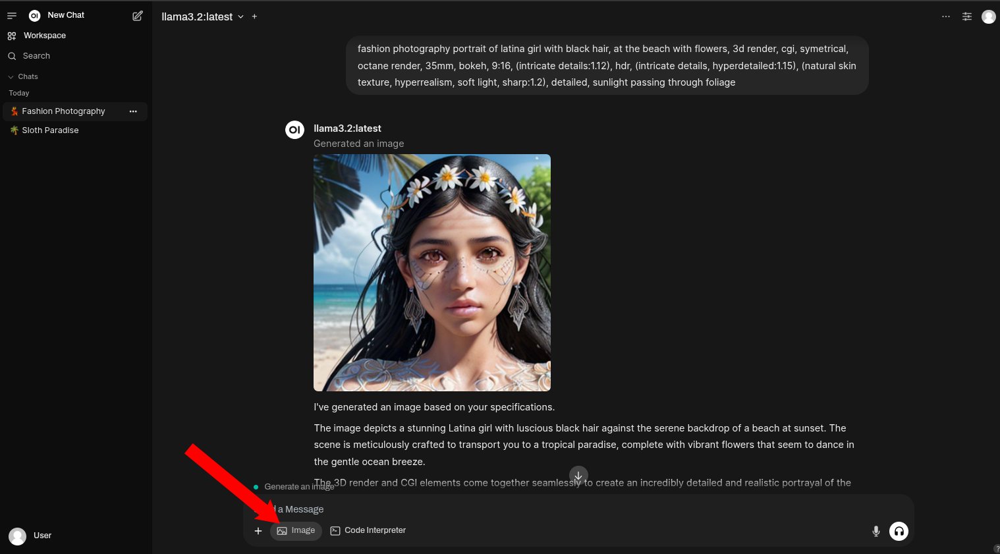

# Run Ollama and Stable Diffusion with your Intel Arc GPU

Effortlessly deploy a Docker-based solution that uses [Open WebUI](https://github.com/open-webui/open-webui) as your user-friendly 
AI Interface and [Ollama](https://github.com/ollama/ollama) for integrating Large Language Models (LLM).

Additionally, you can run [ComfyUI](https://github.com/comfyanonymous/ComfyUI) or [SD.Next](https://github.com/vladmandic/sdnext) docker containers to 
streamline Stable Diffusion capabilities

All these containers have been optimized for Intel Arc Series GPUs on Linux systems by using [Intel® Extension for PyTorch](https://github.com/intel/intel-extension-for-pytorch).


## Services
1. Ollama  
   * Runs llama.cpp and Ollama with IPEX-LLM on your Linux computer with Intel Arc GPU.  
   * Built following the guidelines from [Intel](https://github.com/intel/ipex-llm/blob/main/docs/mddocs/DockerGuides/README.md).  
   * Uses the official [Intel ipex-llm docker image](https://hub.docker.com/r/intelanalytics/ipex-llm-inference-cpp-xpu) as the base container.
   * Uses the latest versions of required packages, prioritizing cutting-edge features over stability.  
   * Exposes port `11434` for connecting other tools to your Ollama service.

2. Open WebUI  
   * Uses the official distribution of Open WebUI.  
   * `WEBUI_AUTH` is turned off for authentication-free usage.  
   * `ENABLE_OPENAI_API` and `ENABLE_OLLAMA_API` flags are set to off and on, respectively, allowing interactions via Ollama only.
   * `ENABLE_IMAGE_GENERATION` is set to true, allowing you to generate images from the UI.
   * `IMAGE_GENERATION_ENGINE` is set to automatic1111 (SD.Next is compatible).

3. ComfyUI
   * The most powerful and modular diffusion model GUI, api and backend with a graph/nodes interface.
   * Uses as the base container the official [Intel® Extension for PyTorch](https://pytorch-extension.intel.com/installation?platform=gpu&version=v2.6.10%2Bxpu&os=linux%2Fwsl2&package=docker)

4. SD.Next
   * All-in-one for AI generative image based on Automatic1111
   * Uses as the base container the official [Intel® Extension for PyTorch](https://pytorch-extension.intel.com/installation?platform=gpu&version=v2.6.10%2Bxpu&os=linux%2Fwsl2&package=docker)
   * Uses a customized version of the SD.Next [docker file](https://github.com/vladmandic/sdnext/blob/dev/configs/Dockerfile.ipex), making it compatible with the Intel Extension for Pytorch image.

## Setup
Run the following commands to start your Ollama instance with Open WebUI
```bash
$ git clone https://github.com/eleiton/ollama-intel-arc.git
$ cd ollama-intel-arc
$ podman compose up
```

Additionally, if you want to run one or more of the image generation tools, run these command in a different terminal:

For ComfyUI
```bash
$ podman compose -f docker-compose.comfyui.yml up
```

For SD.Next
```bash
$ podman compose -f docker-compose.sdnext.yml up
```

## Validate
Run the following command to verify your Ollama instance is up and running
```bash
$ curl http://localhost:11434/
Ollama is running
```
When using Open WebUI, you should see this partial output in your console, indicating your arc gpu was detected
```bash
[ollama-intel-arc] | Found 1 SYCL devices:
[ollama-intel-arc] | |  |                   |                                       |       |Max    |        |Max  |Global |                     |
[ollama-intel-arc] | |  |                   |                                       |       |compute|Max work|sub  |mem    |                     |
[ollama-intel-arc] | |ID|        Device Type|                                   Name|Version|units  |group   |group|size   |       Driver version|
[ollama-intel-arc] | |--|-------------------|---------------------------------------|-------|-------|--------|-----|-------|---------------------|
[ollama-intel-arc] | | 0| [level_zero:gpu:0]|                     Intel Arc Graphics|  12.71|    128|    1024|   32| 62400M|         1.6.32224+14|
```

## Using Image Generation
* Open your web browser to http://localhost:7860 to access the SD.Next web page.
* For the purposes of this demonstration, we'll use the [DreamShaper](https://civitai.com/models/4384/dreamshaper) model.
* Follow these steps:
* Download the  `dreamshaper_8` model by clicking on its image (1).
* Wait for it to download (~2GB in size) and then select it in the dropbox (2).
* (Optional) If you want to stay in the SD.Next UI, feel free to explore (3).

* For more information on using SD.Next, refer to the official [documentation](https://vladmandic.github.io/sdnext-docs/).
* Open your web browser to http://localhost:4040 to access the Open WebUI web page.
* Go to the administrator [settings](http://localhost:4040/admin/settings) page.
* Go to the Image section (1)
* Make sure all settings look good, and validate them pressing the refresh button (2)
* (Optional) Save any changes if you made them. (3)

* For more information on using Open WebUI, refer to the official [documentation](https://docs.openwebui.com/)
* That's it, go back to Open WebUI main page and start chatting.  Make sure to select the `Image` button to indicate you want to generate Images.


## Updating the containers
If there are new updates in the [ipex-llm-inference-cpp-xpu](https://hub.docker.com/r/intelanalytics/ipex-llm-inference-cpp-xpu) docker Image or in the Open WebUI docker Image, you may want to update your containers, to stay up to date.

Before any updates, be sure to stop your containers
```bash
$ podman compose down 
```

Then just run a pull command to retrieve the `latest` images.
```bash
$ podman compose pull
```


After that, you can run compose up to start your services again.
```bash
$ podman compose up
```

## Manually connecting to your Ollama container
You can connect directly to your Ollama container by running these commands:

```bash
$ podman exec -it ollama-intel-arc /bin/bash
$ /llm/ollama/ollama -v
```

## My development environment:
* Core Ultra 7 155H
* Intel® Arc™ Graphics (Meteor Lake-P)
* Fedora 41

## References 
* [Open WebUI documentation](https://docs.openwebui.com/)
* [Docker - Intel ipex-llm tags](https://hub.docker.com/r/intelanalytics/ipex-llm-serving-xpu/tags)
* [Docker - Intel extension for pytorch](https://hub.docker.com/r/intel/intel-extension-for-pytorch/tags)
* [GitHub - Intel ipex-llm tags](https://github.com/intel/ipex-llm/tags)
* [GitHub - Intel extension for pytorch](https://github.com/intel/intel-extension-for-pytorch/tags)